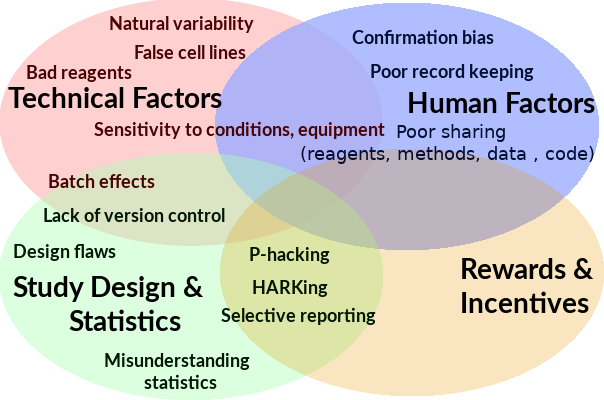
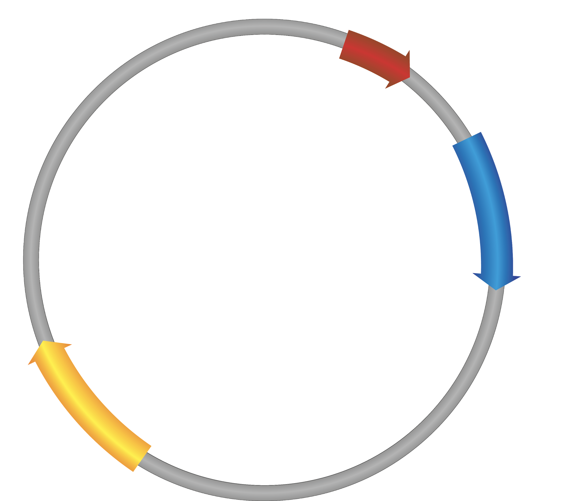
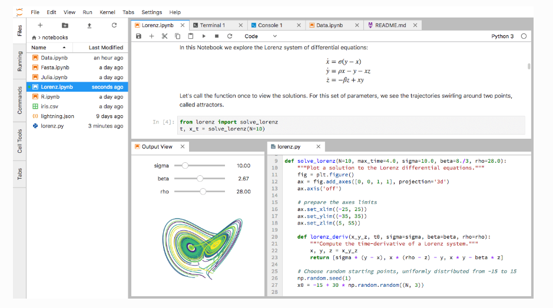

_Event: \{\{eventName\}\}_

# Reproducibility for Everyone

# {{firstInstructorName}}
{{secondInstructorName}}
{{thirdInstructorName}}
{{fourthInstructorName}}

# Slide deck: {{slidesLink}}
Shared notes: {{sharedNotesLink}}
Handout: {{handoutLink}}

\[firstInstructorPhoto\]

# Hello!

# I am 
{{firstInstructorName}}

\{\{firstInstructor __Affiliation__ \}\}

\{\{firstInstructorContact\}\}

# Who are we?

* __Community of scientists in academia and industry who want to improve the reproducibility of science__
  * __Members all over the world\!__
  * __Members help in developing new slides\,__  __hosting workshops\, applying for funding\, etc\.__
* __Developed this__  __open access__  __workshop\, which you can use yourself for a journal club / seminar at your institute\!__
* __Want to join us?__  __Reach out to the workshop organizers or through our website:__  _[https://www\.repro4everyone\.org/join](https://www.repro4everyone.org/join)_

_[https://repro4everyone\.org/](https://repro4everyone.org/)_

# Thank You

Benjamin Schwessinger

@schwessinger

_@repro4everyone_

_hello@repro4everyone\.org_

_www\.repro4everyone\.or_  _g_

# If you want to read more about our initiative:

_[https://osf\.io/dxw67/](https://osf.io/dxw67/)_

__Participants agree to follow the R4E__  __Community Participation Guidelines__  _[repro4everyone\.org/pages/guidelines](https://repro4everyone.org/pages/guidelines/)_

__DO__

__✅__ Be respectful

__✅	Give everyone a chance to contribute__

__✅__ Use inclusive language

__✅__ Appreciate and accommodate differences

__✅__ Lead by example

__DON'T__

__❌__ Repeatedly interrupt or disrupt others

__❌	Use s__ exual language or imagery

__❌	Give__ unwelcome attention

__❌__ Bully\, discriminate\, or harass

__❌	Make fun of personal appearance or choices__

__Have a concern?__

Report by sending a private Zoom chat message to Nele\.

Report by emailing _[coc@repro4everyone\.org](mailto:coc@repro4everyone.org)_ or anonymously at _[https://forms\.gle/UaxjwEYWVNoCDwJs5](https://forms.gle/UaxjwEYWVNoCDwJs5)_

__Violations may result in muting or removing of a participant\.__

# Communication during webinar

* __Questions__ :
  * __Type your question__ into the related section of the shared notes document\.
  * __\+1 questions__ that you like or think are important\.
  * Know the answer to a question? Type it below the question\.

* __Comments__ :
  * Have __experiences or tips__ related to the topic? Type them into the related section of the shared notes document\.
  * __\+1 comments__ that you think were useful\.

# Introduction

# Why does reproducibility matter to you?

# Have you ever had problems reproducing your own or someone else’s research?

# Goals and Objectives

‘Reproducibility’ framework

‘Reproducibility’ tools

Starting point for a ‘lifelong’ journey

# We will look at...

What does reproducibility mean?

What are the different modes of reproducibility?

Is reproducibility all that matters?

‘Reproducibility tool shed:

  * __Organization__
  * __Documentation__

  * __Analysis__
  * __Dissemination__

# What does reproducibility mean?

_Reproducible research_ : Authors provide all the necessary data and the computer codes to run the analysis again\, re\-creating the results\.

_Replication_ : A study that arrives at the same scientific findings as another study\, collecting new data and completing new analyses\.

__Barba\, 2018 \(__  _[https://arxiv\.org/abs/1802\.03311](https://arxiv.org/abs/1802.03311)_  __\)__

__Schloss\, 2018 \(__  _[10\.1128/mBio\.00525\-18](https://mbio.asm.org/content/mbio/9/3/e00525-18.full.pdf)_  __\)__

# Different modes of ‘reproducibility’

__The Turing Way \(__  _[https://the\-turing\-way\.netlify\.app/](https://the-turing-way.netlify.app/)_  __\)__

__Schloss\, 2018 \(__  _[10\.1128/mBio\.00525\-18](http://mbio.asm.org/content/9/3/e00525-18.abstract)_  __\)__

# Is reproducibility all that matters?

__Casadevall and Fang\, 2016 \(__  _[10\.1128/mBio\.01902\-16](https://mbio.asm.org/content/9/1/e00043-18.full.pdf)_  __\)__

_Every little bit helps\!_

_No one is perfect\!_

_Transparent and open science\!_

_Everyone starts somewhere\!_

__Casadevall and Fang\, 2016 \(__  _[10\.1128/mBio\.01902\-16](https://mbio.asm.org/content/9/1/e00043-18.full.pdf)_  __\)__

# Factors decreasing reproducibility

# What can we do by 
the end of the century?

Cori Bargmann\, Howard Hughes Medical Institute Investigator & Chan Zuckerberg Initiative President of Science:

“82 years ago\, there were no antibiotics and we didn’t know that smoking causes lung cancer…

We can expect a lot from the next 82 years\.”

 __Where can we be in 82 years__ 

 __if we__    _accelerate_    __science?__ 

Cori Bargmann\, HHMI Investigator & President CZI Science:

“82 years ago\, there were no antibiotics and we didn’t know that smoking causes lung cancer…

We can expect a lot from the next 82 years\.”

# Where is your greatest potential for growth?

# What are major improvements that could lead to more reproducibility?

Better \+ more detailed methods

Open data \+ metadata

Increased statistical power

Less pressure to publish

Fewer incentives to be first

Better reagent sharing

Better code sharing

# Everyone starts somewhere!

# Every little bit helps!

# No one is perfect!

# Everyone starts somewhere!

# Every little bit helps!

# No one is perfect!

 __Adopting some of these best practices__ 

 __isn’t just good for other scientists…__ 

 __It’s good for you &__ 

 __will save you time in the long term\!__ 

\{\{secondInstructorPhoto\}\}

# Hello!

# I am 
{{secondInstructorName}}

\{\{secondInstructorAffiliation\}\}

\{\{secondInstructorContact\}\}

# Data Management

# Are you familiar with these feelings?

_I cannot find this file\!_

_What did I call it again??_

_Was it the wild type picture or the mutant one?_

_Where is my file??_

_What version was it??_

_Where is my RAW\!\!\! data???_

# Make a plan! 
Be happy!

No need to become a science superhero overnight\!

# Think about...

 __What__   data will be produced as a part of the project?

 __How__   each type of data will be organized\, documented\, standardized\, stored\, protected\, shared and archived?

 __Who__   will take responsibility for carrying out the activities listed above\, and

 __When__   these activities will take place over the course of the project \(and beyond\)?

 __Metadata__ 

_[guides\.lib\.purdue\.edu/c\.php?g=353013&p=2378292](http://guides.lib.purdue.edu/c.php?g=353013&p=2378292)_ \, _[www\.dataone\.org/best\-practices](https://www.dataone.org/best-practices)_

 __Project directory structure__ 

# Develop an informative directory structure
Keep research materials together

* Project\_1
* methods
* raw\_data
* analysis
* scripts
* manuscript
* readme and/or ELN link

Inspired by  _[‘Bioinformatic data skills’](http://shop.oreilly.com/product/0636920030157.do)_

by Vincent Buffalo

 __Project directory structure__ 

_Specific content in each category for Project \#1_

* Project\_1
* methods
* raw\_data
  * readme
* analysis
  * analysis\_method\_1
    * 2017
    * 2018
  * analysis\_method\_2
* scripts
* manuscript
  * text
    * version\_1
* readme and/or ELN link

__Raw data\,__

__Data analysis\, and Manuscript__

Inspired by  _[‘Bioinformatic data skills’](http://shop.oreilly.com/product/0636920030157.do)_

by Vincent Buffalo

# Project directory structure

* __Project\_1__
  * __methods__
  * __raw\_data__
    * readme
  * __analysis__
    * analysis\_method\_1
      * 2017
      * 2018
    * Analysis\_method\_2
  * __scripts__
  * __manuscript__
    * text
      * Version\_1
  * __readme and/or ELN link__

Always keep   __raw__   data\!

Always  b  ackup  d  ata

\(3x and synchronized: 3 unique locations \- cloud\, server\,

personal drive\)

Inspired by  _[‘Bioinformatic data skills’](http://shop.oreilly.com/product/0636920030157.do)_

by Vincent Buffalo

# File naming conventions

What did you call the last file you generated?

Did you have rules?

_[http://guides\.lib\.purdue\.edu/c\.php?g=353013&p=2378292](http://guides.lib.purdue.edu/c.php?g=353013&p=2378292)_

_[http://kbroman\.org/dataorg/](http://kbroman.org/dataorg/)_

_The rules don’t matter; that you have rules matters_

Include date in yyyy\-mm\-dd format

Use meaningful abbreviations

Have group identifiers

Document your decisions

Be consistent

Use version numbers

_[guides\.lib\.purdue\.edu/c\.php?g=353013&p=2378292](http://guides.lib.purdue.edu/c.php?g=353013&p=2378292)_ \, _[kbroman\.org/dataorg/](http://kbroman.org/dataorg/)_

Example

_20130825_  \_  DOEProject  \_  _Ex1Test1_  \_  Data  \_  _Gonzalez_  \_  v3\-03  \.xlsx

_[http://guides\.lib\.purdue\.edu/c\.php?g=353013&p=2378292](http://guides.lib.purdue.edu/c.php?g=353013&p=2378292)_

# Electronic Notebooks

# Paper Lab-notebooks - in use since the 15th Century!

Good record keeping is important for:

Dissemination of ideas\, findings\,

Legally binding records that protects intellectual property

Not searchable\!

Can be easily damaged\, misplaced

Not easy to back up

Hard to share with collaborators

__Leonardo da Vinci’s notebook\,__

__Codex Arundel c\. 1458\-1518__

__British Library__

# Why should you use an Electronic Lab Notebook?

__Search__

Easily searchable both in online and offline searches

__Export__

Data can be exported as PDF \(must backup regularly\)

__Share__

Easily shareable with collaborators and broader community

__Embed__

Can embed high res images\, protocols\, & more

__Mobile__

Use the mobile app to quickly upload images

__Access__

Easily accessible globally \(depend on connectivity\)

# Basic features of an Electronic Lab Notebook

# Cost considerations - Available Products

Paid for \- Bio\-Itech\, LabArchives\, LabGuru

Paid \(with free version\) \- SciNote\, Benchling

Open source \- Open wet ware\, ELOG

Free \- Open Science Framework \(OSF\.io\)\, LocalWiki

Kanza\,  _[10\.1186/s13321\-017\-0221\-3](https://jcheminf.biomedcentral.com/articles/10.1186/s13321-017-0221-3)_

# One size does not fit all

 __Available lab notebooks__ 

 __Parameters__ 

 __to consider__ 

 __ELN Features__ 

 __Matrix__ 

_[https://datamanagement\.hms\.harvard\.edu/electronic\-lab\-notebooks](https://datamanagement.hms.harvard.edu/electronic-lab-notebooks)_

# General tips on electronic record keeping

Back\-up data regularly

Maintain a physical observation notebook in parallel

Mobile apps provide added portability

If using free ELNs\, check privacy and data ownership policies

# Organizing and Sharing Protocols

# Being able to find optimized protocols for your organism / tissue of choicecan save you months!

_[https://medium\.com/@tpoi](https://medium.com/@tpoi)_

I create them myself

# Where do you find your protocols?

Contacting an expert in the field

# Description 
Unavailable

# Description
Ambiguous

_[https://medium\.com/@tpoi](https://medium.com/@tpoi)_

# Use repositories, not supp. files

 _[https://protocolexchange\.researchsquare\.com](https://protocolexchange.researchsquare.com/)_ 

 _[https://www\.protocols\.io](https://www.protocols.io/)_ 

 _[https://theplosblog\.plos\.org/2020/12/show\-your\-work\-peer\-reviewed\-protocols/](https://theplosblog.plos.org/2020/12/show-your-work-peer-reviewed-protocols/)_ 

 __Accelerate Science__ 

→ Increase Discoverability → Reproducibility

→ Facilitate Research Connections

→ Enable Reuse

→ Enhance Value of Research

# Protocol drawing exercise

__1\.__ Draw a small 8/10th of an oval in the center of your paper with the open part facing to the bottom left\. __2\.__ Draw ⅓ of a large circle underneath the oval and draw small perpendicular lines on each end of it\. __3\.__ At the center of the ⅓ circle\, draw two squares with a small gap between them\. __4\.__ Draw a wavy line underneath the squares\. __5\.__ On the ends of the larger circle\, draw smaller half circles around them with three dots in the middle\. __6\.__ Draw two big circles on each side of the small oval from the beginning\. They should be more on the top than on the bottom\. __7\.__ In the big circles\, draw smaller circles and in the smaller circles draw even smaller filled in circles\. __8\.__ Draw a wavy square around everything you drew so far\. __9\.__ Draw 7 small ovals within the space of the square\.

One protocol

\- many results\!

# Detail & Digitize Protocols

* Think of protocol as brief\, modular\, _self\-contained_ scientific publication
* Include 3\-4 sentence abstract that _puts methodology in context_
* Include _as much detail as possible_
  * duration/time per step
  * reagent amount
  * vendor name
  * catalogue number

__Expected result__

__Safety information__

__Software package__

Chronology of steps

Notes\, recipes\, tips and tricks

Use protocols\.io\, Google Docs\, and/or ELN \(not paper or MS Word\) \- __need versioning__

_[https://www\.protocols\.io/view/how\-to\-make\-your\-protocol\-more\-reproducible\-discov\-g7vbzn6](https://www.protocols.io/view/how-to-make-your-protocol-more-reproducible-discov-g7vbzn6)_  _[https://www\.aje\.com/en/arc/how\-to\-write\-an\-easily\-reproducible\-protocol/](https://www.aje.com/en/arc/how-to-write-an-easily-reproducible-protocol/)_

\{\{thirdInstructorPhoto\}\}

# Hello!

# I am 
{{thirdInstructorName}}

\{\{thirdInstructor __Affiliation__ \}\}

\{\{thirdInstructorContact\}\}

# ‘Wet lab’ Reagent Sharing

# Problems with wet-lab reagent availability

Scientist makes and publishes a reagent

 __“available upon request”__ 

Scientist leaves the lab and stores published reagent in freezer

Other scientists request the reagent \, but no one else remembers where it is stored\!

In 2005\, NIH Study found that half of the mouse lines had been remade at least twice

Only 12% were available from repositories

It can take years and cost $$$ for researchers to make a mouse strain\.

Lloyd et al\. Nature 2015   _[10\.1038/522151a](https://dx.doi.org/10.1038%2F522151a)_ 

doi:10\.1126/science\.aau9619

* __Requesting researcher:__
  * __Waiting to receive the reagent from corresponding author delays research__
  * __Having to recreate it themselves can introduce errors which can lead to inaccurate or misleading results\.__
* __Corresponding author:__  __Individual labs don’t always have the resources to__
  * __Properly track and store all reagents__
  * __Consistently authenticate all reagents in the lab__
  * __\(Legally\) distribute all reagents to requesting researchers__
  * __Ability to navigate shipping and export/import regulations__
* __Reagents repositories are part of the solution\!__

# Functions of reagent repositories

Speedier access to materials

Authenticate reagents and maintain quality control

Curate reagents and standardize reagent information

Facilitate and track shipping

# How to improve reagent sharing & reporting

Record how a reagent was created

Authenticate\!

__Provide associated publications & protocols__

When naming reagents you make\, use descriptive and standardized naming conventions

Record and include the reagent’s catalog \# or RRID in your protocols\, lab notebooks and manuscript\(s\)

Deposit reagents & organisms you make with a repository\!

# Benefits of depositing reagents

__DIRECT__

Archiving

Reducing time spent sending out reagents

Authentication/Quality Control

__INDIRECT__

Creation of educational content

Direct promotion

Analysis of reagent distribution

_[https://blog\.addgene\.org/addgene\-depositors\-get\-more\-citations](https://blog.addgene.org/addgene-depositors-get-more-citations)_

# Examples of reagent/organism repositories

Addgene

ATCC \(American Type Culture Collection\)

ABRC \(Arabidopsis Biological Resource Center\)

Bloomington Drosophila Stock Center

Caenorhabditis Genetics Center

Developmental Studies Hybridoma Bank

EUROSCARF \(EUROpean Saccharomyces Cerevisiae ARchive for Functional analysis\)

MMRRC \(Mutant Mouse Resource and Research Centers\)

National Xenopus Resource \(NXR\)

ZIRC \(Zebrafish International Resource Center\)

# Addgene: The nonprofit biomaterials repository

__Goal:__ To accelerate science by improving access to research materials and information

__Issues Addressed:__ Difficulties in obtaining\, verifying\, and using plasmids from other labs

__Audience:__ Academic\, nonprofit\, and industry scientists doing biology research and using plasmids and viral vectors\.

__Services:__

Stores and distributes plasmids and prepared viral vectors

Verifies plasmids and viral vectors through DNA sequencing with some functional testing

Collates/curates information about plasmids and viral vectors

Produces and freely distributes educational content to make it easier for scientists to learn about and use new technologies

# Summary of reagent sharing

Sharing increases access and speeds up science\.

Record key details about reagents you are using\!

Deposit reagents you make\! Improves reagent sharing and reproducibility\.

\{\{fourthInstructorPhoto\}\}

# Hello!

# I am 
{{fourthInstructorName}}

\{\{fourthInstructor __Affiliation__ \}\}

\{\{fourthInstructorContact\}\}

# Bioinformatics Tools
for computational reproducibility

# What version of the program, data, etc… did I use? Why won’t it work?

__Why did I do this?__

Dependency hell \(files require other files\)

_[https://carpentries\.org](https://carpentries.org)_  _[‘Bioinformatic data skills’](http://shop.oreilly.com/product/0636920030157.do)_  __Vincent Buffalo__

# Document your analysis with literate programming

Documentation of your analysis narrative and the analysis code together in one executable document

What you did and why you did it

Interactive data exploration

Easily shared

Best start: Jupyter Notebooks or RMarkdown with KnitR

_[https://jupyter\.org/](https://jupyter.org/)_

_[https://www\.rstudio\.com](https://www.rstudio.com)_

# Jupyter Notebooks - Example

# Document changes

With version control

Git

Records changes \(what\, when\, who\)

Documents version history

Illustrates changes between versions \(diffs\)

Github

Lets you share code easily

Lets you collaborate on your code more easily

__Version\-control__

__system that__

__uses__  _forks_  __and__  _pull requests_  __\.__

Git\-based repository with

a social media component\.

_[http://smutch\.github\.io/VersionControlTutorial//](http://smutch.github.io/VersionControlTutorial//)_

# How did I install all these different software packages???

Version conflict

# Document your computational environment with package, dependency & environment managers

Python virtual environments

Dependency managers

Handles installs & dependencies

Document your environment \(requirements\.txt\)

__In RStudio\, use CRAN and RProjects__

__Document your packages \(install\.R\)__

_[https://conda\.io/](https://conda.io/)_  _[https://bioconda\.github\.io/](https://bioconda.github.io/)_

# Make your environment portable with containers

Everything needed to run your analysis is packed up into an “image”

Images are self\-contained with all code\, programs\, environment\, Dockerfile included

No subsequent installation required

Spin an image into a container using Docker or Singularity \- it is like sharing your computer

_[https://docs\.docker\.com](https://docs.docker.com)_

__Make your environment portable with containers__

__Binder uses the environment documentation file from your Github repo to automatically build a shareable Docker image__

__R__  __uns in the cloud__

__E__  __xecutable__

_[https://tinyurl\.com/jupyter\-binder2\-0](https://tinyurl.com/jupyter-binder2-0)_  _[https://tinyurl\.com/eLife\-binder2\-0](https://tinyurl.com/eLife-binder2-0)_

# Data and code sharing

__What to share?__

Data & code necessary to __validate findings__ & __reproduce results__

Data & code that might be __valuable__ to other researchers/policy makers

Data & code which __cannot be \(easily\) re\-generated__

 __Why share?__ 

Funder or publisher mandates

Citation benefits \(Piwowar 2013\,  _[https://doi\.org/10\.7717/peerj\.175](https://doi.org/10.7717/peerj.175)_  \)

Preserve long\-term access to data

__How to share?__

__Choose open\, persistent\, and non\-proprietary__  __file formats__

__Create and share__  __documentation__  __to enable reuse__

__Include__  __data__  __citations__  __of source data__

__Create rich__  __metadata__

# Data sharing

Jonathan D\. Wren;   __URL decay in MEDLINE—a 4\-year follow\-up study__   \, 2008   _Bioinformatics_ 

_[https://doi\.org/10\.1093/bioinformatics/btn127](https://doi.org/10.1093/bioinformatics/btn127)_

* __Data Repository__
* Use a data repository not your website\. They provide:
* Persistent identifiers for your data \(like DOI\)
  * Unique & citable
  * Prevents “link rot”
* Persistent access
* Preservation
* Backup
* Management of access
* Versioning
* Licensing

 __Data License__ 

Consider   __Creative Commons licenses__   for data & text

Either CC\-0 or CC\-BY

Guidance on data licenses available through Digital Curation Center:

_[http://www\.dcc\.ac\.uk/resources/how\-guides\-license\-research\-data](http://www.dcc.ac.uk/resources/how-guides-license-research-data)_

__Code License__

__Consider open source license such as MIT\, BSD\, or Apache license__

__Guidance on software licenses by Karl Broman \(__  _[http://kbroman\.org/steps2rr/pages/licenses\.html](http://kbroman.org/steps2rr/pages/licenses.html)_  __\) and Open Source Initiative \(__  _[https://opensource\.org/licenses](https://opensource.org/licenses)_  __\)__

# Mandated vs. Disciplinary Repositories

__Identify mandated / disciplinary repository:__

__Funder specified repository__

__Institutionally specified data repository__

__Domain or discipline\-specific data repository__

__Find & compare disciplinary repositories through Repository of Research Data Repositories__  _[https://www\.re3data\.org/](http://www.re3data.org/)_

# General Purpose Repositories

__In addition to a specified data repository\, you can make a deposit to a general purpose repository:__

__DataDryad__  _[http://datadryad\.org/](http://datadryad.org/)_  __\(curated digital repository; free to access\, $120 to publish dataset up to 20GB\)__

__Figshare__  _[https://figshare\.com/](https://figshare.com/)_  __\(free digital repository\, 5GB per file limit\)__

__Zenodo__  _[https://zenodo\.org/](https://zenodo.org/)_  __\(free digital repository; 50GB per dataset limit\)__

# Zenodo meets GitHub

# FAIR Data

# Get organized! Be happy!

 _The Turing Way_   project illustration by Scriberia\. Original version on Zenodo\. http://doi\.org/10\.5281/zenodo\.3695300\.

# Data Visualization 
& Analysis

# Data presentation is the foundation of our collective scientific knowledge...

# Figures are especially important. They often show data for key findings.

# Effective figures should...

Immediately convey information about __study design__

Illustrate __important findings__

Allow the reader to __critically evaluate__ the data:Show your data\!

Weissgerber et al\.  _[10\.1074/jbc\.RA117\.000147](http://www.jbc.org/content/early/2017/10/03/jbc.RA117.000147)_

# The usual way and its flaws...

* Issues:
* Reproducible Workflows?
  * Problems can be avoided by using macros or dashboards
  * However\, who uses these?
* Excel renames Genes
  *  _[Ziemann et al\.\, 2016](https://doi.org/10.1186/s13059-016-1044-7)_ 
  * 20% of papers in leading genomic journals contain gene list errors
* Default Plots are often Bar Charts and Line Plots

Weissgerber et al\. 2017  _[10\.1074/jbc\.RA117\.000147](http://www.jbc.org/content/early/2017/10/03/jbc.RA117.000147)_

# Show your data

# Never trust data based on the summary statistics alone!There really is NO alternative to showing the actual data

 _[Same Stats\, Different Graphs: Generating Datasets with Varied Appearance and Identical Statistics through Simulated Annealing](https://www.autodeskresearch.com/publications/samestats)_ 

 _[Same Stats\, Different Graphs: Generating Datasets with Varied Appearance and Identical Statistics through Simulated Annealing](https://www.autodeskresearch.com/publications/samestats)_ 

# Our interpretation depends on what we see

# Avoid bar charts for continuous data

Weissgerber et al\.  _[https://doi\.org/10\.1371/journal\.pbio\.1002128](https://doi.org/10.1371/journal.pbio.1002128)_

# How to choose the right plot

_[Weissgerber et al\.\, 2017 JBC](http://www.jbc.org/content/292/50/20592.full)_

# Making effective dot plots

# One step further: Interactive plots

_[Interactive Dot Plot](http://statistika.mfub.bg.ac.rs/interactive-dotplot/)_

_[Interactive Line Graph](http://statistika.mfub.bg.ac.rs/interactive-linegraph/)_

# Some intermediate options

_[https://plot\.ly/create/\#/](https://plot.ly/create/#/)_

# Reproducible research practices enable you to:

Accurately analyze results

Share results with future researchers

Organize experiments productively

Share techniques

Share reagents with future researchers

Accelerate science\!

Tools discussed here should provide you with the framework to make you research more reproducible and will save you time and resources in the long term

# Questions?

Feedback: 
{{postSurveyLink}}

