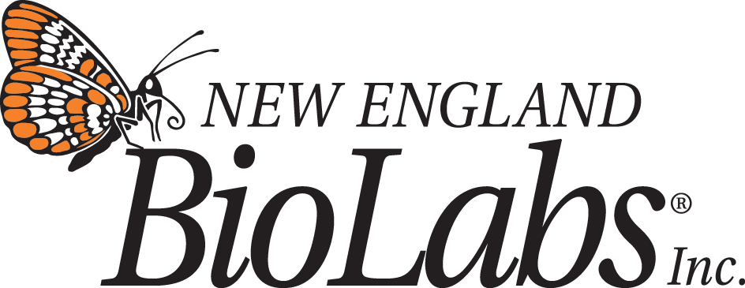
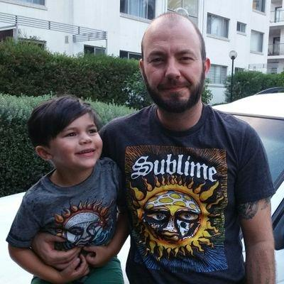
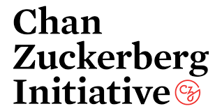
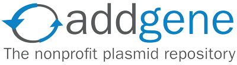
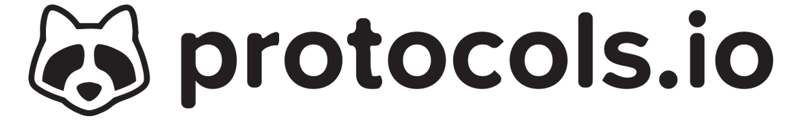
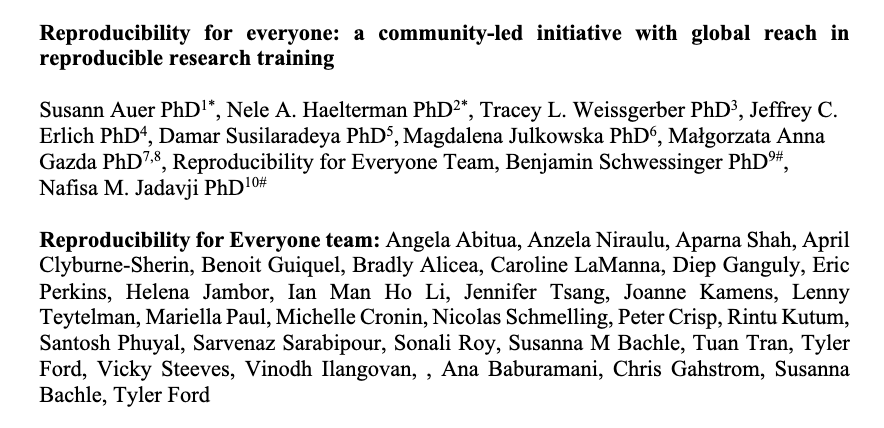

\[firstInstructorPhoto\]

# Hello!

# I am 
{{firstInstructorName}}

\{\{firstInstructor __Affiliation__ \}\}

\{\{firstInstructorContact\}\}

# Who are we?

* __Community of scientists in academia and industry who want to improve the reproducibility of science__
  * __Members all over the world\!__
  * __Members help in developing new slides\,__  __hosting workshops\, applying for funding\, etc\.__
* __Developed this__  __open access__  __workshop\, which you can use yourself for a journal club / seminar at your institute\!__
* __Want to join us?__  __Reach out to the workshop organizers or through our website:__  _[https://www\.repro4everyone\.org/join](https://www.repro4everyone.org/join)_

_[https://repro4everyone\.org/](https://repro4everyone.org/)_

# Thank You

Benjamin Schwessinger

@schwessinger

_@repro4everyone_

_hello@repro4everyone\.org_

_www\.repro4everyone\.org_

# If you want to read more about our initiative:

_[https://osf\.io/dxw67/](https://osf.io/dxw67/)_

__Participants agree to follow the R4E__  __Community Participation Guidelines__  _[repro4everyone\.org/pages/guidelines](https://repro4everyone.org/pages/guidelines/)_

__DO__

__✅__ Be respectful

__✅	Give everyone a chance to contribute__

__✅__ Use inclusive language

__✅__ Appreciate and accommodate differences

__✅__ Lead by example

__DON'T__

__❌__ Repeatedly interrupt or disrupt others

__❌	Use s__ exual language or imagery

__❌	Give__ unwelcome attention

__❌__ Bully\, discriminate\, or harass

__❌	Make fun of personal appearance or choices__

__Have a concern?__

Report by sending a private Zoom chat message to Nele\.

Report by emailing _[coc@repro4everyone\.org](mailto:coc@repro4everyone.org)_ or anonymously at _[https://forms\.gle/UaxjwEYWVNoCDwJs5](https://forms.gle/UaxjwEYWVNoCDwJs5)_

__Violations may result in muting or removing of a participant\.__

